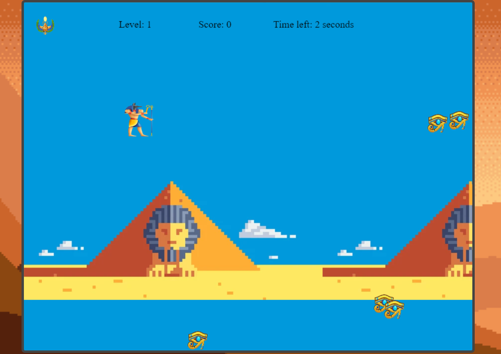

### Gems Hunter Game

Is a canvas game, the objective is collecting all the gems before the time runs out.
Each level gems and character gets generated and a countdown starts, the player must collect all the gems to pass the level before 15 seconds run out.

#### Gameplay Screenshots

#### Game instructions
Use the arrows to move around the canvas
:arrow_up: :arrow_down: :arrow_left: :arrow_right:
Get the :gem:

#### TODO
This project is not finished yet, here is a list of what i would like to improve
- gems value should be random, while now at each gem generation they have the same value
- add other music
- player to only be inside canvas
- torch effect -> https://codepen.io/judyhopps/pen/xXQVbx
- refactoring

#### Resources
 :boom: This is only an exercise to get better at JS, if any of your content should not be included in this repository, please reach out and it will be removed asap :boom:
- Music: Egyptian theme https://freesound.org/people/PureDesignGirl/sounds/444668/
Coin sound https://freesound.org/s/518888/
- Rules fade in/out logic: https://codepen.io/pborad/pen/qmMmgX
- Images from shutterstock/other sources
